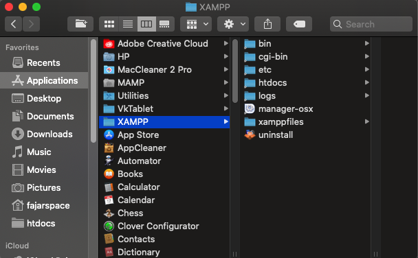

| Nama      | Fajar Agung Nugroho |
| ----------- | ----------- |
| NIM     | 312010448       |
| Kelas   | TI.20.A.1        |

## Langkah langkah praktikum 7

## 1. Install XAMPP
Unduh XAMPP dari https://www.apachefriends.org/download.html

## 2. Menjalankan web server
Untuk menjalankan web server dari menu XAMPP Control

• Uji coba apakah server sudah berkerja dengan baik
http://127.0.0.1 atau http://localhost

Tampil halaman utama XAMPP jika server sudah berkerja dengan baik.

• Dokumen Website
Semua file website tempatkan di direktori: \xampp\htdocs\

• Database MySQL
Direktori: \xampp\mysql\

Manajemen database: http://localhost/phpmyadmin

## 3. Memulai PHP
Buat folder lab7_php_dasar pada root directory web server (\xampp\htdocs)

Kemudian untuk mengakses direktory tersebut pada web server dengan mengakses URL:
http://localhost/lab7_php_dasar/

## 4. PHP Dasar
Buat file baru dengan nama php_dasar.php pada directory tersebut. Kemudian buat
kode seperti berikut.

Kemudian untuk mengakses hasilnya melalui URL:
http://localhost/lab7_php_dasar/php_dasar.php

### Variable PHP
Menambahkan variable pada program.

